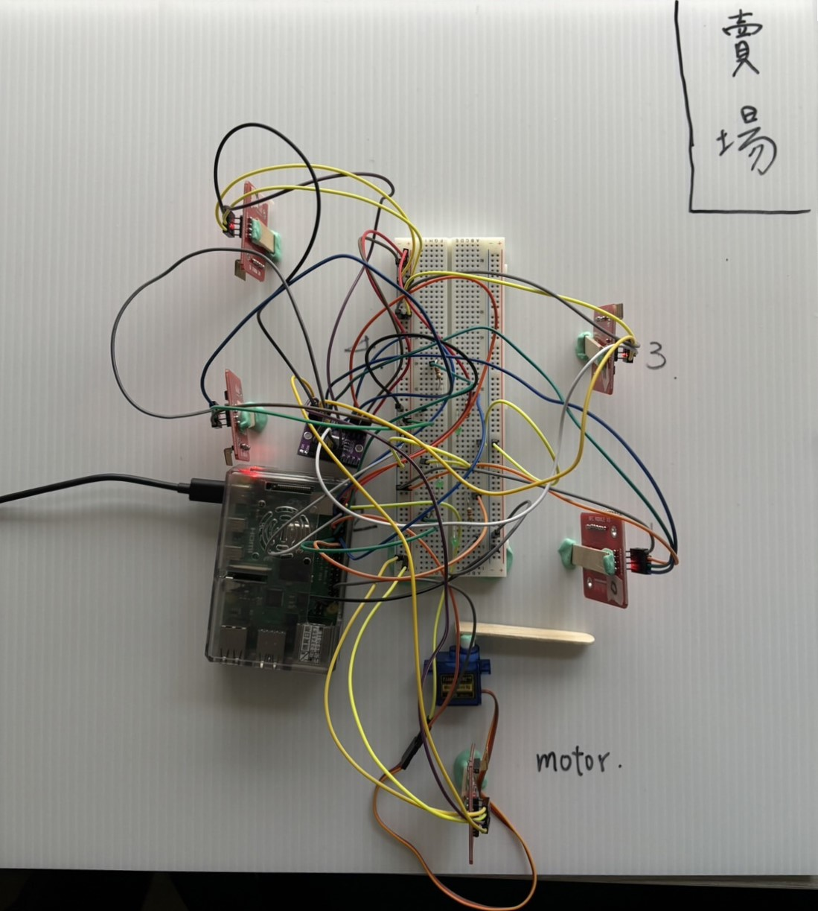
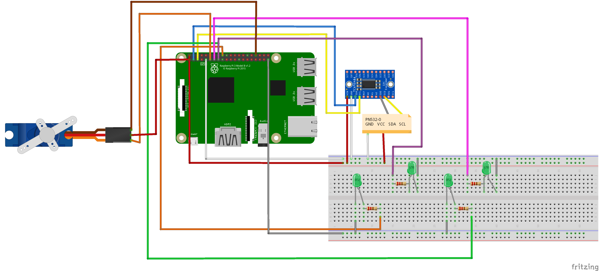
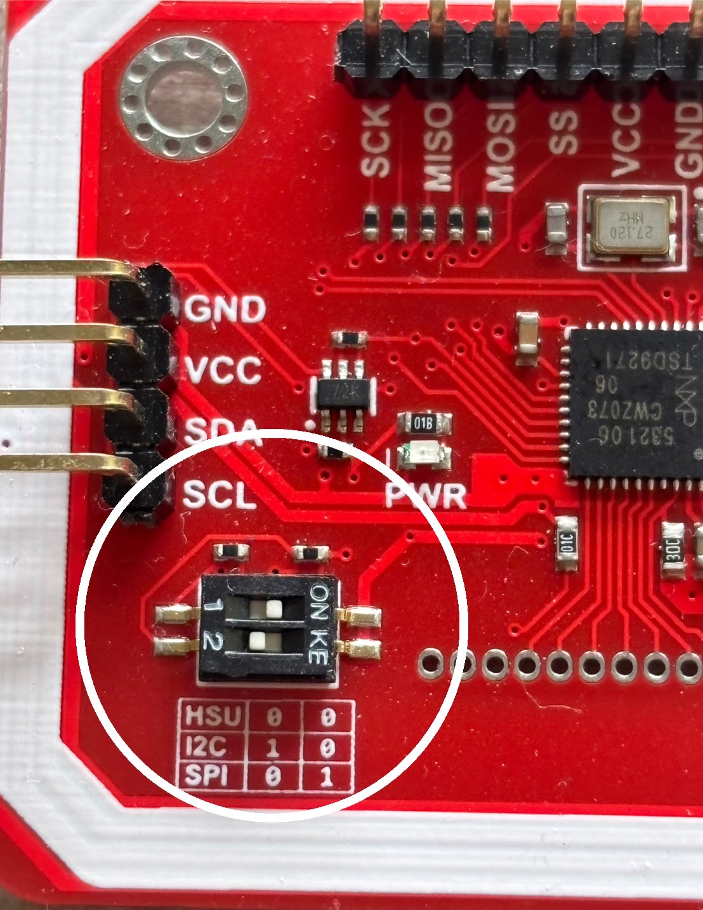
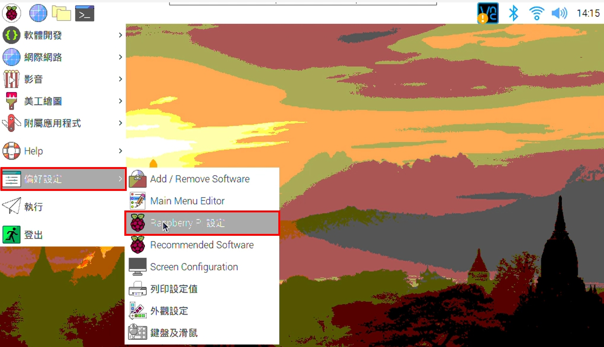
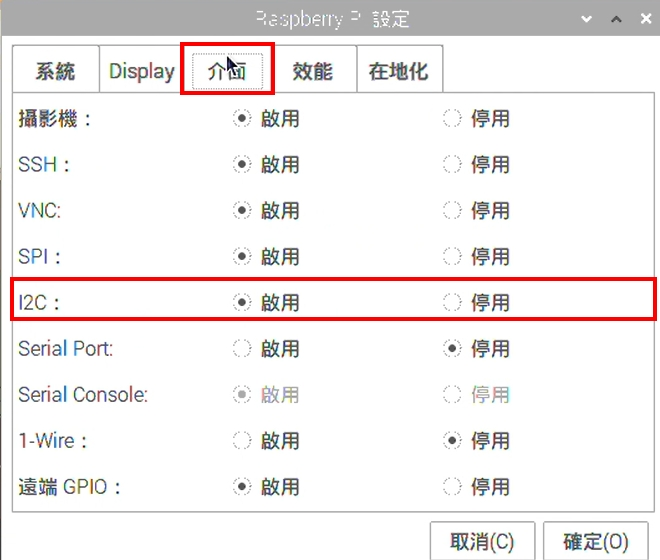

# IoT Smart Parking System
**NCU MIS IoT Project**  
*By Hsin Ni Liao*  
*January 2025*
## Introduction
The system will navigate entering vehicles to the parking space closest to the store entrance. The LED light blinks so the drivers can see the parking space in a short time and save time walking to the entrance.


Details for PN532 connection:

| PN532 Module | Connected TCA9548A Channel | PN532 SDA Connected to  | PN532 SCL Connected to  |
|--------------|-----------------------------|--------------------------|--------------------------|
| PN532 #1     | Channel 0                  | TCA9548A Channel 0 SDA0 | TCA9548A Channel 0 SCL0 |
| PN532 #2     | Channel 1                  | TCA9548A Channel 1 SDA1 | TCA9548A Channel 1 SCL1 |
| PN532 #3     | Channel 3                  | TCA9548A Channel 3 SDA3 | TCA9548A Channel 3 SCL3 |
| PN532 #4     | Channel 4                  | TCA9548A Channel 4 SDA4 | TCA9548A Channel 4 SCL4 |
| PN532 #5     | Channel 5                  | TCA9548A Channel 5 SDA5 | TCA9548A Channel 5 SCL5 |

Remember to switch your PN532 to I2C mode



## Hardwares
- **RaspberryPi 4**
- **Breadboard**
- **Lots of dupont lines** (male/male, male/female, male/male)
- **TCA9548A**
- **PN532** x5 (may modify to fit your needs)*
- **RFID sticker** (13.56M 26MM ISO 14443A)
- **SG90 servo motor**
- **Green LED** x4 (depends on how many parking spots)*
- **Popsicle sticks**
- **Foamboard**
- **Circuit Diagram**

## Setup
Since the PN532 uses I2C communication, make sure I2C is enabled.

 

Since the Python version on the Raspberry Pi is 3.7 but this project requires Python 3.8, to simplify operations, please first download Python 3.8 and then create a virtual environment to run the program within it. The instructions are as follows:


### Steps

#### 1. Install Python 3.8
[Instructions for installation](https://itheo.tech/install-python-38-on-a-raspberry-pi).

Check version by entering:

``python3.8 --version``


Success!
#### 2.	Update the System and Install Required Tools
Make sure your Raspberry Pi system is up to date and install the necessary tools for creating virtual environments.

``
sudo apt update
sudo apt upgrade -y
sudo apt install python3-venv -y``

#### 3.	Create the Virtual Environment
Navigate to your desired directory and create a virtual environment named my_env:

``python3 -m venv my_env``

Replace my_env with your preferred name for the virtual environment.This command creates a folder named my_env in the current directory, which contains all the necessary files for the virtual environment.
#### 4.	Activate the Virtual Environment
To start using the virtual environment, activate it with the following command:

``source my_env/bin/activate``

Once activated, your terminal prompt will show (my_env), indicating that you are now working inside the virtual environment.
 


#### 5.	Deactivate the Virtual Environment
When you're done working in the virtual environment, deactivate it using:
``deactivate``

This will return you to the global Python environment.
### Install packages
- #### For PN532:
``pip install adafruit-circuitpython-pn532``

if there’s an error message, enter 

``pip install adafruit-blinka adafruit-circuitpython-busdevice``

- #### For servo motor

``pip install gpiozero``

``pip install pigpio``(make sure to enter ``sudo pigpiod`` before running the code)
- #### For TCA9548A
``pip install adafruit-circuitpython-tca9548a``

if there’s an error message, enter

``pip install adafruit-blinka adafruit-circuitpython-busdevice``
### Program Code
All codes are in the folder “IoT_Project”, you may download them and have a closer look. Some further details will be explained below:

#### 1. PN532.py
The code works, but sometimes the I2C devices are not very stable. You can use the following methods to check if the PN532 and TCA9548A are properly connected.

To check if the I2C devices are connected, enter ``i2cdetect -y 1``. If the output matches the example shown in the image below, your TCA9548A has been successfully connected.


To verify each PN532 on its respective channel, you can use the code below. It's recommended to check each channel individually, as this makes it easier to identify any issues that may arise.
```
import board
import busio
from adafruit_tca9548a import TCA9548A
from adafruit_pn532.i2c import PN532_I2C
import time

# 初始化 I2C 和 TCA9548A
i2c = busio.I2C(board.SCL, board.SDA)
tca = TCA9548A(i2c)

# 檢查通道和設備
def check_channel_and_devices(tca_mux, channel):
    print(f"Checking channel {channel}...")
    try:
        i2c_channel = tca_mux[channel]
        if i2c_channel.try_lock():
            devices = i2c_channel.scan()
            i2c_channel.unlock()
            print(f"Devices on channel {channel}: {[hex(addr) for addr in devices]}")
            return devices
        else:
            print(f"Unable to lock channel {channel}")
    except Exception as e:
        print(f"Error on channel {channel}: {e}")
    return []

# 測試 PN532 功能
def test_pn532_on_channel(tca_mux, channel):
    print(f"Testing PN532 on channel {channel}...")
    try:
        i2c_channel = tca_mux[channel]
        pn532 = PN532_I2C(i2c_channel)
        pn532.SAM_configuration()  # 初始化 PN532

        print("Place a card on the PN532 module...")
        uid = pn532.read_passive_target(timeout=5.0)
        if uid:
            card_id = ''.join([hex(i)[2:] for i in uid])
            print(f"Card detected on channel {channel}, ID: {card_id}")
        else:
            print(f"No card detected on channel {channel}")
    except Exception as e:
        print(f"Error on channel {channel}: {e}")

# 主程式
if __name__ == "__main__":
    print("Starting TCA9548A I2C multiplexer test")
    for channel in range(8):
        check_channel_and_devices(tca, channel)
    
    # 測試特定通道上的 PN532
    for channel in [0, 1, 3, 4, 5]:
        test_pn532_on_channel(tca, channel)
```
You should see something like this:


#### 2.	Motor.py
Depends on the angle you want your fence to go up and down, you may change the code. For more detail, visit [Control motor](https://docs.sunfounder.com/projects/umsk/en/latest/05_raspberry_pi/pi_lesson33_servo.html).
#### 3. clear.py and viewDatabase.py
These two files allow the programmer to revert changes of ``car.json``and check its current content.
#### 4. main.py
Run this code to see the smart parking system!
## Video link


        


